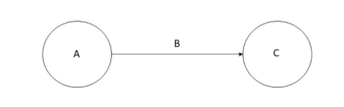

검색엔진을 만들다 Knowledge Graph에 대해 좀더 알아보고 싶어졌다.

그 와중에 Knowlege Graph에 대해 스탠포드에서 제공하는 가 있어, 듣기 시작! 

강의는 총 20강으로 되어 있고, 두달에 걸처 강의를 정리하고 공부해볼 생각이다.

### 차례

1. What is a Knowledge Graph?
2. What are some Knowledge Graph data models?
3. How to design the schema of a Knowledge Graph?
4. How to create a Knowledge Graph from Data?
5. How to create a Knowledge Graph from Unstructured Input?
6. What are some inference algorithms for Knowledge Graphs?
7. How do users interact with a Knowledge Graph?
8. How to evolve a Knowledge Graph?
9. What are some high value use cases of Knowledge Graphs?
10. What are some implementation tools for Knowledge Graphs? && What are some research issues in Knowledge Graphs?

로 진행될 예정이다.

## 1. What is a Knowledge Graph?
[노트](https://web.stanford.edu/class/cs520/2020/notes/What_is_a_Knowledge_Graph.html)
### 1-1. 코스 소개
지식 그래프는 인터넷을 통해 세계의 구조화된 지식을 구성하고, 기업에 대한 주요 entity 간의 관계를 포착하고 여러 데이터 소스에서 추출한 정보를 통합하는 방법에 대한 흥미로운 관심에 의해서 등장하였다. 또한 지식 그래프는 세계 지식을 통합하고 기계학습과 자연어 처리에서 중심적인 역할을 하기 시작하였다, 

이 수업은 대학원 수준의 연구 세미나로 지식 그래프 주제에 대한 강의와 실무자들의 초청 강의가 포함되어있다. 

이 수업의 목표는 지식그래프에서 사용되는 용어들과 개념 및 사용법을 이해하기 쉬운방식으로 설명하는데 있다.

이 수업에서는 지시그래프에 대한 과거 그리고 현재에 대한 철저한 조사를 하지는 않는다.

이 수업은 최근 지식그래프의 인기 급상승에 기여한 어플리 케이션 소개 부터 시작하여 기계학습에서 지식그래프를 사용하고, 최근 지식그래프의 사용에 대한 새로운 점과 다른점을 요약한다.

### 1-2. 지식 그래프의 정의

지식 그래프는 라벨 의미가 잘 정의된 방향 라벨 그래프이다. 
방향 라벨 그래프는 __노드, 엣지, 그리고 라벨__ 로 구성되어 있다. 
모든 것들이 노드가 될수있다. (사람 회사 컴퓨더 등등), 
엣지는 한쌍의 노드들을 연결하고, 그들 사이의 관계를 포착한다. (두사람의 친구 관계, 회사와 사람간의 고객관계 또는 두 컴퓨터 간의 네트워크 관계등이 예가 될것이다.)
라벨은 이러한 관계들의 의미를 나타낸다.

좀더 형식적으로 표현하자면 노드 집합 n과 라벨 집합l 이 주어지면 지식 그래프는 n x l x n 의 부분 집합이다.

구성요소들을 시각화 하면 아래와 같이 표현이 가능하다.

방향 그래프는 응용프로그램의 필요에 따라 다양한 방식으로 사용 가능하다. 노드가 사람이고 엣지가 친구 관계를 포착하는 방향 그래프를 데이터 그래프라고 한다. 노드는 객체 클래스라고 하고, 엣지가 하위 클래스들의 관계를 포착하는 방향그래프를 분류법이라고 한다.

위 그림에서 a를 주어 b를 술어 c를 객체라고 한다,

그래프에 대한 많은 흥미로운 계산들은 탐색을 통해 줄여갈 수 있다. 예를들어 친구관계 지식 그래프에서 A의 친구의 친구를 계산 하기 위해 우리는 A와 친구로 연결된 모든 노드 B로 이동한 다음, 각각의 B와 친구관계에 연결된 모든 노드 c로 재귀 적으로 이동한다.

### 1-3 최근 지식 그래프 어플리ㅣ케이션

현재 많은 연구실과 산업에서 많은 지식그래프 어플리켕션이 사용되고 있다. 컴퓨터 싸이언스 분야에서는 데이터 흐름 그래프, 이진 의사 결정 다이어그램, 상태 차트 등과 같은 방향 그래프 표현이 많이 사용된다. 

여기 이 수업에선 최근 지식 그래프의 인기를 급증시킨 두가지 구체적인 응용프로그램 (데이터 통합및 인터넷 정보구성)에 초점을 맞추어 수업한다.

### 1-3-1. 인터넷의 지식을 구성하기 위한 지식그래프

### 코스 소개
지식 그래프는 인터넷을 통해 세계의 구조화된 지식을 구성하고, 기업에 대한 주요 entity 간의 관계를 포착하고 여러 데이터 소스에서 추출한 정보를 통합하는 방법에 대한 흥미로운 관심에 의해서 등장하였다. 또한 지식 그래프는 세계 지식을 통합하고 기계학습과 자연어 처리에서 중심적인 역할을 하기 시작하였다, 

이 수업은 대학원 수준의 연구 세미나로 지식 그래프 주제에 대한 강의와 실무자들의 초청 강의가 포함되어있다. 

### 강의 자료
[강의자료 링크](https://web.stanford.edu/class/cs520/)

